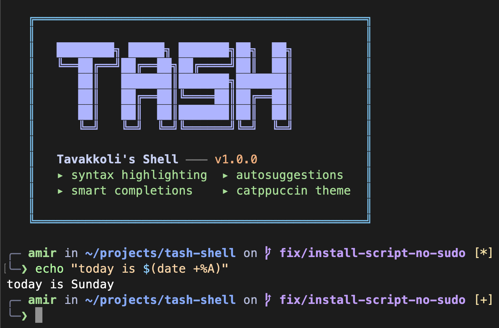

# Tash — A Modern Unix Shell

A feature-rich Unix shell written in C++ with syntax highlighting, autosuggestions, smart completions, and a Catppuccin color palette. Built as a deep exploration of systems programming — from `fork`/`exec` to signal handling to interactive line editing.

[](https://github.com/tavakkoliamirmohammad/tash-shell/stargazers)
[](https://opensource.org/licenses/MIT)
[](https://github.com/tavakkoliamirmohammad/tash-shell/actions)
[](https://github.com/tavakkoliamirmohammad/tash-shell/actions)
[](https://github.com/tavakkoliamirmohammad/tash-shell/pulls)

<!-- TODO: Replace with actual screenshot/GIF of tash in action -->


## Highlights

- **Syntax highlighting** — commands glow green if valid, red if not, as you type
- **Autosuggestions** — gray ghost text from history, press `Right` to accept
- **"Did you mean?"** — typo `gti` suggests `git` via Damerau-Levenshtein distance
- **Smart completions** — Tab completes builtins, PATH commands, git/docker subcommands, `$VAR` names
- **Catppuccin Mocha** — a warm, classy color palette across the entire shell
- **AI powered** — `@ai` generates commands, explains errors, writes scripts (Gemini, OpenAI, or Ollama)
- **275 automated tests** — Google Test suite covering every feature

## Features

| Category | Features |
|----------|----------|
| **Interactive** | Syntax highlighting, autosuggestions (ghost text), `Tab` completion, `Right` to accept hint, `Alt+Right` to accept one word, `Alt+.` to insert last argument |
| **Execution** | Pipes (`\|`), command substitution (`$(cmd)`), script execution (`tash script.sh`) |
| **Redirection** | stdout (`>`, `>>`), stdin (`<`), stderr (`2>`, `2>&1`) |
| **Operators** | `&&` (and), `\|\|` (or), `;` (sequential) |
| **Variables** | `$VAR`, `${VAR}`, `$?` (exit status), `$$` (PID), `export`, `unset` |
| **Expansion** | Glob (`*`, `?`, `[...]`), tilde (`~`), command substitution (`$(...)`) |
| **Navigation** | `cd`, `cd -`, `pushd`/`popd`/`dirs`, **auto-cd** (type directory name), **`z`** (frecency jump) |
| **Job Control** | `bg`, `fg`, `bglist`, `bgkill`, `bgstop`, `bgstart` |
| **Aliases** | `alias ll='ls -la'`, `unalias`, expansion before execution |
| **History** | Persistent `~/.tash_history`, dedup, ignore-space, `!!`, `!n`, arrow navigation |
| **Multiline** | Auto-continue on unclosed quotes or trailing `\|`/`&&`, backslash continuation |
| **Prompt** | Catppuccin-themed two-line prompt with git branch, dirty/clean status (`+*?`), exit code indicator (green/red `❯`), command duration |
| **AI** | `@ai <anything>` — ask in natural language, multi-provider (Gemini/OpenAI/Ollama), streaming output, conversation memory, `@ai config` |
| **Safety** | Ctrl+D protection (double-press), bracketed paste, SIGINT handling |
| **Config** | `~/.tashrc` loaded on startup |
| **Platform** | Linux (Ubuntu, Fedora, Alpine) and macOS (Intel + ARM) |

## Quick Start

```sh
# Build
cmake -B build && cmake --build build

# Run
./build/tash.out
```

### Prerequisites

- **OpenSSL** and **libcurl** (for AI features) — available on all macOS and Linux systems
- The build system fetches [replxx](https://github.com/AmokHuginnsson/replxx), [nlohmann/json](https://github.com/nlohmann/json), [cpp-httplib](https://github.com/yhirose/cpp-httplib), and [Google Test](https://github.com/google/googletest) automatically via CMake FetchContent

```sh
# Ubuntu/Debian
sudo apt install libssl-dev libcurl4-openssl-dev

# Fedora/RHEL
sudo dnf install openssl-devel libcurl-devel

# Alpine
apk add openssl-dev curl-dev

# macOS — included with Xcode Command Line Tools
xcode-select --install
```

### Install System-Wide

```sh
curl -sSL https://raw.githubusercontent.com/tavakkoliamirmohammad/tash-shell/master/install.sh | bash
```

Or with Homebrew:
```sh
brew install --formula Formula/tash.rb
```

## Usage

```
╭─ amir in ~/projects/tash on  master [*?]
❯ ls | grep cpp | wc -l
       6

╭─ amir in ~/projects/tash on  master
❯ gti status
gti: No such file or directory
tash: did you mean 'git'?

╭─ amir in ~/projects/tash on  master
❯ echo "today is $(date +%A)"
today is Friday

╭─ amir in ~/projects/tash on  master took 3.2s
❯ /tmp                          # auto-cd: just type a directory
/private/tmp

╭─ amir in /private/tmp on  master
❯ z proj                        # frecency jump to most-visited match
/Users/amir/projects

╭─ amir in ~/projects on  master
❯ export NAME=world && echo $NAME
world
```

### AI Features

Tash includes AI features with support for **Google Gemini** (free), **OpenAI**, and **Ollama** (local). Just type `@ai` followed by anything in natural language.

```
╭─ amir in ~/projects on  master
❯ @ai find all files larger than 100MB
tash ai ─
find . -type f -size +100M

╭─ amir in ~/projects on  master
❯ gcc -o main main.c
main.c:1:10: fatal error: 'stdio.h' file not found

╭─ amir in ~/projects on  master [1]
❯ @ai explain this error
tash ai ─
The compiler can't find 'stdio.h'. Install the development headers:
  sudo apt install build-essential    # Linux
  xcode-select --install              # macOS

╭─ amir in ~/projects on  master
❯ @ai what does tar -xzvf archive.tar.gz
tash ai ─
  -x  extract files from archive
  -z  decompress through gzip
  -v  verbose — list files as they're extracted
  -f  use the specified archive file

╭─ amir in ~/projects on  master
❯ @ai write a script to backup my home directory
tash ai ─
  #!/bin/bash
  tar -czf /tmp/home_backup_$(date +%F).tar.gz ~/
  echo "Backup complete"

╭─ amir in ~/projects on  master
❯ @ai how do I set up SSH keys for GitHub
tash ai ─
  1. Generate key: ssh-keygen -t ed25519 -C "you@email.com"
  2. Start agent: eval "$(ssh-agent -s)"
  3. Add key: ssh-add ~/.ssh/id_ed25519
  4. Copy public key: cat ~/.ssh/id_ed25519.pub
  5. Go to GitHub → Settings → SSH Keys → New SSH Key → paste
```

| Command | Description |
|---------|-------------|
| `@ai <anything>` | Ask the AI anything — commands, explanations, scripts, guidance. It figures out what you need. |
| `@ai config` | Configure provider, model, API keys, and view status. |
| `@ai clear` | Clear conversation history. |
| `@ai on` / `@ai off` | Enable or disable AI features. |

#### Setting Up a Provider

Run `@ai config` to interactively choose your provider and set API keys:

**Gemini (free):**
1. Go to [aistudio.google.com/apikey](https://aistudio.google.com/apikey)
2. Sign in, click "Create API Key", copy it
3. Run `@ai config` → option 3 → paste key

**OpenAI:**
1. Go to [platform.openai.com/api-keys](https://platform.openai.com/api-keys)
2. Create an API key
3. Run `@ai config` → option 1 → type `openai` → option 3 → paste key

**Ollama (local, free):**
1. Install Ollama: [ollama.com](https://ollama.com)
2. Run `ollama serve` and `ollama pull qwen3.5:0.8b`
3. Run `@ai config` → option 1 → type `ollama`

#### Conversation Memory

The AI remembers context within a session — ask follow-up questions naturally:

```
❯ @ai find files larger than 100MB
❯ @ai now delete them
❯ @ai clear     # reset conversation when done
```

## Keyboard Shortcuts

| Key | Action |
|-----|--------|
| `Tab` | Complete command, file, git/docker subcommand, or `$VAR` |
| `Right` | Accept the gray autosuggestion (at end of line) |
| `Alt+Right` | Accept one word from the autosuggestion |
| `Alt+.` | Insert the last argument of the previous command |
| `Up/Down` | Navigate command history |
| `Ctrl+R` | Reverse search through history |
| `Ctrl+L` | Clear screen |
| `Ctrl+C` | Cancel current input / kill foreground process |
| `Ctrl+D` | Exit shell (press twice) |

## Built-in Commands

| Command | Description |
|---------|-------------|
| `cd [dir]` | Change directory. `cd -` returns to previous. `cd ~` goes home. |
| `z <pattern>` | Jump to most-visited directory matching pattern (frecency). |
| `pwd` | Print current directory. |
| `exit` | Exit the shell. |
| `history` | Show command history. `!!` repeats last, `!n` repeats nth. |
| `export VAR=val` | Set environment variable. No args lists all. |
| `unset VAR` | Remove environment variable. |
| `alias name='cmd'` | Create alias. No args lists all. |
| `unalias name` | Remove alias. |
| `source file` | Execute file in current shell (`. file` also works). |
| `which cmd` | Find command location or identify builtins. |
| `type cmd` | Same as `which`. |
| `clear` | Clear screen (Ctrl+L also works). |
| `bg cmd` | Run command in background. |
| `fg [n]` | Bring background job to foreground. |
| `bglist` | List background jobs. |
| `bgkill n` | Kill background job n. |
| `bgstop n` | Stop background job n. |
| `bgstart n` | Resume background job n. |
| `pushd dir` | Push directory onto stack and cd. |
| `popd` | Pop directory from stack and cd. |
| `dirs` | Show directory stack. |
| `@ai <question>` | AI-powered assistant — ask anything in natural language. |

## Architecture

```
Input → Replxx (highlighting + hints + completion)
  → History Expansion (!! / !n)
  → @ai interception (→ LLM API if AI command)
  → Multiline Continuation (unclosed quotes, trailing |/&&)
  → Parse Operators (&&, ||, ;)
  → For each command:
      Expand Variables ($VAR, $?, $$)
      → Command Substitution $(...)
      → Parse Redirections (>, >>, <, 2>, 2>&1)
      → Tokenize → Strip Quotes → Expand Aliases
      → Expand Globs → Auto-cd check
      → Dispatch: Builtin table | Background | Pipeline | fork/exec
      → "Did you mean?" on exit code 127
```

### Source Files

| File | Purpose |
|------|---------|
| `main.cpp` | Entry point, replxx setup, command execution loop |
| `parser.cpp` | Tokenizer, variable/command expansion, redirection parsing |
| `builtins.cpp` | Dispatch table for 22 built-in commands |
| `process.cpp` | fork/exec, pipelines, background processes |
| `completion.cpp` | Tab completion (builtins, PATH, git/docker, $VAR) |
| `highlight.cpp` | Syntax highlighting + autosuggestion hints |
| `suggest.cpp` | "Did you mean?" via Damerau-Levenshtein distance |
| `history.cpp` | Persistent history with dedup and ignore-space |
| `frecency.cpp` | Frecency-based directory tracking for `z` |
| `prompt.cpp` | Two-line prompt with git status and command duration |
| `colors.cpp` | ANSI color wrapper functions |
| `theme.h` | Catppuccin Mocha color palette definitions |
| `ai_handler.cpp` | @ai command routing and unified AI handler |
| `llm_client.cpp` | Multi-provider LLM client (Gemini, OpenAI, Ollama) with streaming |
| `ai_config.cpp` | Provider config, API key management, rate limiter, usage tracking |
| `context_suggest.cpp` | Context-aware autosuggestion engine |

## Color Palette

Tash uses the [Catppuccin Mocha](https://catppuccin.com) palette — a warm, soothing dark theme:

| Element | Color | Catppuccin Name |
|---------|-------|-----------------|
| Valid command | `#a6e3a1` | Green |
| Builtin command | `#94e2d5` | Teal |
| Invalid command | `#f38ba8` | Red |
| Strings | `#f9e2af` | Yellow |
| Variables | `#89dceb` | Sky |
| Operators | `#cba6f7` | Mauve |
| Redirections | `#fab387` | Peach |
| Comments | `#6c7086` | Overlay0 |
| Banner | `#b4befe` | Lavender |
| Git branch | `#cba6f7` | Mauve |
| Prompt arrow (ok) | `#a6e3a1` | Green |
| Prompt arrow (err) | `#f38ba8` | Red |

## Testing

```sh
cmake -B build -DBUILD_TESTS=ON
cmake --build build
ctest --test-dir build --output-on-failure -V
```

275 tests across 18 test files using Google Test:
- **130+ unit tests** — tokenizer, parser, variable expansion, redirections, command suggestions, frecency, AI parser, key management, JSON builders/parsers (Gemini/OpenAI/Ollama), LLM factory, rate limiter, retry logic, context suggestions
- **140+ integration tests** — pipes, redirection, operators, aliases, scripts, history, auto-cd, z command, "did you mean?", multiline, AI subcommands, provider switching, stderr capture

## Contributing

Contributions are welcome! See [CONTRIBUTING.md](CONTRIBUTING.md) for how to get started.

If you find Tash useful, please consider giving it a star — it helps others discover the project.

## License

MIT License — Copyright (c) 2020 Amir Mohammad Tavakkoli
